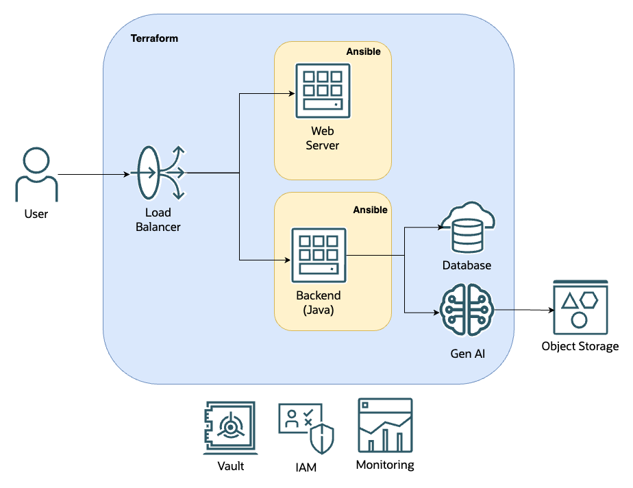

# OCI Gen AI POC



## Local deployment

Run locally with these steps [Local](LOCAL.md)

## Build artifacts

### Build Java Application:

```bash
cd backend
```

```bash
./gradlew bootJar
```

> `build/libs/backend-0.0.1.jar` jar file generated

```bash
cd ..
```

### Build Web Application:

```bash
cd web
```

```bash
npm run build
```

> `dist` folder generated

```bash
cd ..
```

## Set Up environment

```bash
cd scripts/ && npm install && cd ..
```

### Set the environment variables

```bash
npx zx scripts/setenv.mjs
```

> Answer the Compartment name where you want to deploy the infrastructure. Root compartment is the default.

### Collect and deliver the artifacts

```bash
npx zx scripts/artifacts.mjs
```

### Build TF Vars file

```bash
npx zx scripts/tfvars.mjs
```

## Deploy

```bash
cd deployment/terraform
```

Init Terraform providers:

```bash
terraform init
```

Apply deployment:

```bash
terraform apply --auto-approve
```

```bash
cd ../..
```

## SSH into machines

If you need to connect with the compute instances, there is two bastion sessions created for backend 0 and web 0 instances. To see the command, type the following command and copy and paste the one you need.

```bash
npx zx scripts/bastion.mjs
```

## Clean up

Destroy infrastructure with Terraform.

```bash
cd deployment/terraform
```

```bash
terraform destroy -auto-approve
```

```bash
cd ../..
```

Clean up the artifacts on Object Storage

```bash
npx zx scripts/clean.mjs
```

## Issues

There is an issue in Terraform `oracle/oci` provider on version `v5.25.0`. It is not updated to the specific version of `terraform-plugin-sdk` that fix the underlying gRCP limit of 4Mb.

The project would want to upload artifacts to Object Storage, like the backend jar file, which is bigger than 4Mb.

```terraform
data "local_file" "backend_jar_tgz" {
  filename = "${path.module}/../../.artifacts/backend_jar.tar.gz"
}
```

As a workaround, a `script/deliver.mjs` script and a `script/clean.mjs` script will deliver and clean the artifacts into Object Storage and make Pre-Authenticated Requests available for Terraform resources.
